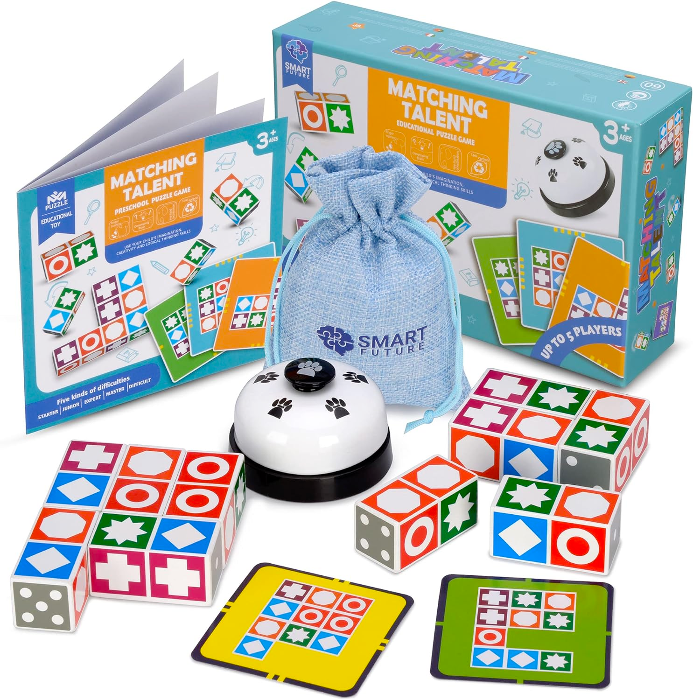

# matching-puzzle-helper

A simple tool to help you solve the matching puzzle



## Usage

```commandline
> python3 main.py

Please input the target board:
D: 八边形, O: 圆型, E: 方形, +: 加号, *: 星型, 空格: 空白
Please input row 1: O+DE
Please input row 2:  *+E
Please input row 3:  EEE
🎉 Solved with 293 steps!
Result:
5522
 144
 133

```